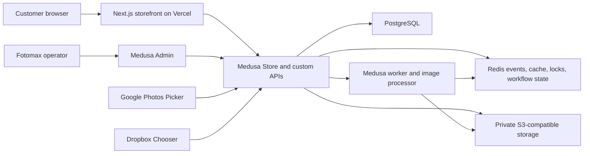

# Fotomax Phase 2 Transaction And Photo Commerce Design

## Status

Approved through section-by-section review on 2026-07-11.

This document defines the next phase after the Fotomax Commerce Storefront Foundation. It replaces the Phase 1 fixture-backed runtime boundary with a deployed Medusa transaction system and adds a production-shaped standard photo-print workflow.

## Context

Phase 1 delivered a bilingual Next.js storefront with homepage, category, product, service, cart, and localized recovery routes. It also established a Medusa v2 application, catalog seed inputs, shared bilingual data, responsive browser coverage, and a working Vercel storefront deployment.

The current customer-facing catalog still reads local shared fixtures. Cart behavior is browser-local, and Medusa is not yet the live source of catalog, inventory, customer, cart, fulfillment, or order state. Photo upload, print configuration, private media storage, payment processing, branch inventory, account history, and production operations were intentionally deferred.

Phase 2 converts that foundation into a public staging commerce system while keeping production activation separate.

## Goal

Deliver a public staging environment where a customer can browse live Medusa data, purchase fixed-SKU retail products or standard photo prints, combine both in one cart, choose Hong Kong delivery or branch pickup, complete a simulated payment, and create an order visible to operations.

A standard photo-print customer must be able to import photos, recover interrupted work, review quality warnings, configure prints in batches with per-photo overrides, receive a server-authoritative quote, and carry immutable production instructions into the completed order.

## Approved Product Decisions

| Decision | Approved Direction |
| --- | --- |
| Delivery strategy | Vertical slices with staging verification after each slice |
| Commerce scope | Fixed-SKU retail and standard photo-print products |
| Payment | Medusa system payment provider; no external charge or payment webhook |
| Fulfillment | Hong Kong delivery and store pickup |
| Customer identity | Guest-first checkout with optional accounts |
| Photo editing | Batch defaults with per-photo overrides |
| Photo sources | Device/system picker, Google Photos, and Dropbox |
| iCloud access | Through the Apple device/system picker, not a separate web connector |
| Social sources | Adapter extension only when an approved provider API is available |
| Pickup inventory | Medusa-managed test inventory per branch with reservation |
| POS integration | Deferred |
| Abandoned media retention | Seven days |
| Fulfilled-order media retention | Thirty days after fulfillment |
| Deployment target | Public staging with managed test infrastructure |

## Release Boundary

Phase 2 includes:

- Live bilingual catalog, variants, prices, categories, and availability from Medusa.
- Persistent Medusa carts for guests and signed-in customers.
- Medusa-managed inventory and reservations for retail products at branch stock locations.
- Standard photo-print product configuration and production metadata.
- Direct device uploads and imports from Google Photos and Dropbox.
- Private storage for originals and generated previews.
- Batch print settings with per-photo crop, fit, and quantity overrides.
- One cart for retail variants and configured photo-print jobs.
- Guest checkout, optional accounts, order history, and eligible draft recovery.
- Hong Kong delivery and branch pickup.
- Simulated payment through Medusa's system provider.
- Order, fulfillment, inventory, and photo-production handling in Medusa Admin.
- Bilingual test notifications captured by a staging notification provider.
- Public staging deployment, observability, and end-to-end verification.

Phase 2 does not include:

- Real payment authorization, capture, refund, or production payment webhooks.
- Production traffic cutover.
- POS, ERP, or real-world branch inventory synchronization.
- Production-capacity scheduling for photo labs.
- Social photo imports without an approved provider API.
- A native iOS or Android application.
- A permanent customer photo library.
- Multi-page photobook authoring.
- Freeform personalized-product design.
- Document-print estimation or PDF finishing workflows.
- Split fulfillment across multiple methods in one order.

Photobooks, freeform personalized products, and document printing remain separate future authoring engines rather than being approximated inside the standard print editor.

## Delivery Strategy

### Phase 2A: Transaction Foundation

Phase 2A moves the storefront from fixtures to Medusa and completes a retail purchase journey:

- Deploy Medusa API and worker modes against staging PostgreSQL and Redis.
- Make Medusa the runtime source for catalog, categories, variants, prices, and inventory.
- Seed branch stock locations, retail inventory, branch metadata, and standard print capabilities.
- Add persistent guest and customer carts.
- Add guest-first identity, optional accounts, and account order history.
- Add delivery and pickup fulfillment selection.
- Add the Medusa system payment provider and order completion.
- Verify orders, reservations, fulfillment data, and Admin visibility in staging.

Phase 2A is independently useful: retail customers can place simulated orders before the photo workflow is attached.

### Phase 2B: Photo Production

Phase 2B adds the standard photo-print vertical slice:

- Add private object storage and direct resumable upload sessions.
- Add the custom photo domain, API routes, workflows, and Admin surface.
- Add asynchronous file validation, metadata extraction, previews, and quality estimates.
- Add the batch-first photo editor and per-photo overrides.
- Add server-authoritative print quotes and cart attachment.
- Group print lines in the customer cart while retaining Medusa variant-level pricing.
- Freeze production instructions on checkout and expose them securely to operations.
- Add retention cleanup and deletion evidence.

### Phase 2C: Sources And Staging Hardening

Phase 2C completes external sources and the release gate:

- Add the Google Photos Picker adapter.
- Add the Dropbox Chooser adapter.
- Normalize device, Google, and Dropbox files through one ingestion contract.
- Add captured bilingual notifications and customer-action links.
- Complete mobile, desktop, accessibility, recovery, security, and failure-path coverage.
- Run deployment-specific live verification with no runtime fixture fallback.

Each slice is deployed and verified before the next begins. Feature flags keep incomplete photo and source flows unavailable to ordinary staging users.

## System Architecture

### Next.js Storefront

The storefront remains responsible for bilingual routes, navigation, discovery, product presentation, editor interaction, cart presentation, checkout screens, accessibility, and recovery UX.

The storefront uses a typed Medusa access layer. Phase 1 fixture objects remain available only for seed generation, unit tests, and explicit local development tools. Public staging has no fixture fallback.

The browser never receives database credentials, persistent provider tokens, private object credentials, or trusted pricing controls.

### Medusa API And Worker

Medusa runs separately from the Vercel storefront in persistent server and worker modes.

Medusa owns:

- Product, variant, region, price, inventory, cart, customer, fulfillment, payment-session, and order records.
- Store and Admin API authorization.
- Branch capability and stock-location configuration.
- Photo-job lifecycle, pricing, cart attachment, and order linkage.
- Event emission, idempotent workflows, cleanup scheduling, and operational state.

The worker handles asynchronous imports, image processing, retries, retention cleanup, and captured notifications. API instances do not perform long image-processing tasks inside customer requests.

### PostgreSQL

PostgreSQL is authoritative for commerce data and photo metadata. It stores references and instructions, not image binaries.

Database migrations are forward-only during deployment. Application rollback does not automatically reverse destructive schema or data changes.

### Redis

Redis provides production-shaped event handling, cache, distributed locking, and workflow coordination. It prevents competing workers from processing or expiring the same record simultaneously.

### Private Object Storage

Originals, previews, and production derivatives use private S3-compatible storage. Access is granted through short-lived signed operations scoped to one authenticated job, asset, or operations action.

Objects use randomized keys unrelated to customer names or original filenames. Lifecycle cleanup is implemented by application records plus storage policies, with application evidence confirming the intended deletion.

### Source Adapters

Every source adapter produces the same normalized ingestion request:

- Source type and provider item identifier.
- Display filename and reported media type.
- Expected byte size when available.
- A short-lived method for retrieving the selected bytes.
- An idempotency key tied to the photo job and provider selection.

The system immediately imports selected external files into Fotomax private storage. Provider URLs are not used as durable production inputs.

Google Photos uses the current Picker API session model. Dropbox uses the Chooser and immediately consumes direct links before they expire. Apple customers reach iCloud-backed media through the device/system photo or file picker.

## Data Ownership And API Boundary

Storefront components consume normalized domain DTOs rather than raw Medusa responses. The access layer hides pagination, locale projection, publishable-key configuration, and Medusa response details.

Custom Store APIs cover these conceptual operations:

- Create, retrieve, and resume a photo job.
- Create signed upload sessions and confirm completed uploads.
- Create and complete external import sessions.
- Retrieve processing and quality status.
- Create a new configuration version.
- Request a server quote.
- Attach a quoted version to a Medusa cart.
- Remove or reopen a draft print job.

Custom Admin APIs cover:

- Search and inspect photo jobs linked to orders.
- Retrieve production manifests.
- Create short-lived audited asset access.
- Retry safe processing failures.
- Update production readiness and status.
- Manage branch print capabilities and lead times.

Exact route names are an implementation-plan decision. Ownership, authorization, and state transitions defined here are not optional.

## Photo Domain Model

### PhotoJob

A `PhotoJob` is the customer-owned aggregate for one standard print configuration session.

It contains:

- Guest-session or customer ownership.
- Region, locale, and currency.
- Selected standard print product family.
- Lifecycle status.
- Active version identifier.
- Cart and order linkage.
- Creation, activity, retention, fulfillment, and expiry timestamps.
- Failure state and customer-recoverable action where applicable.

### PhotoAsset

A `PhotoAsset` represents one imported original and its processing state.

It contains:

- Photo-job ownership.
- Source type and provider item identifier when applicable.
- Randomized original and preview object keys.
- Sanitized display filename.
- Detected file type, byte size, checksum, width, height, and orientation.
- Processing status and quality metrics.
- Validation errors and non-blocking warnings.
- Retention and deletion timestamps.

### ImportSession

An `ImportSession` tracks a short-lived device or provider selection. It records state and provider identifiers but does not retain broad cloud-library authorization after import.

### PhotoJobVersion

A `PhotoJobVersion` is an immutable snapshot of print instructions and its quote.

It contains:

- Sequential version number.
- Source asset set.
- Print-item instructions.
- Server-calculated subtotal and currency.
- Referenced Medusa variants and price context.
- Warning acknowledgements.
- Quote creation and expiry timestamps.
- Cart attachment state.

Editing creates a new version. Ordered versions are never modified.

### PrintItem

A `PrintItem` contains one asset's production instructions:

- Referenced Medusa print variant.
- Print size and paper finish.
- Border choice.
- Crop or fit mode.
- Normalized crop transform.
- Quantity.
- Unit price snapshot.
- Quality warnings acknowledged by the customer.

### Branch Capability

Retail stock uses Medusa inventory items, stock locations, reservations, and release workflows.

Standard photo-print products are production services rather than stocked units. A branch capability record identifies supported print variants and advertised lead times. Phase 2 validates capability but does not schedule lab capacity.

## Lifecycle And Concurrency

The primary photo-job lifecycle is:

`draft -> uploading/importing -> processing -> ready -> cart-attached -> ordered -> fulfilled -> expired`

Failure and cancellation are explicit side states with controlled recovery transitions.

Uploads, imports, processing callbacks, quote requests, cart attachment, order completion, notifications, and cleanup are idempotent.

Checksums prevent accidental duplicate storage within a job. Optimistic version checks prevent two tabs from silently overwriting the same configuration. Redis-backed locks prevent competing workers from processing or deleting the same asset concurrently.

Removing a print line from the cart releases the associated non-ordered job version for editing. Completing checkout freezes the selected version. Cancelling an order follows Medusa's order and inventory workflows before photo-retention timing changes.

## Catalog, Pricing And Cart Representation

Medusa products and variants represent finite retail and standard print SKUs. Standard print variants capture sellable combinations such as size and finish. Border and other no-cost instructions may remain photo configuration fields when they do not alter the SKU or price.

The photo quote service maps each configured print item to a published Medusa variant, current region price, and applicable quantity rules. It rejects unpublished, unavailable, incompatible, or stale selections.

A photo job may produce multiple Medusa cart lines when its photos use different variants. Those lines share a photo-job version identifier and are grouped as one editable print job in the customer cart.

The client never submits trusted unit prices or totals. Medusa recalculates the quote before cart attachment and revalidates it before checkout. A stale price, inventory state, branch capability, or configuration returns the customer to review without discarding accepted uploads.

## Customer Experience

### Retail Purchase

1. Browse live category and product data.
2. Select a published variant.
3. Review price and branch or delivery availability.
4. Add the Medusa variant to the persistent cart.

### Standard Photo Print

1. Choose the standard print product.
2. Import photos from the device/system picker, Google Photos, or Dropbox.
3. Show resumable transfer and asynchronous processing progress.
4. Block corrupt or unsupported files.
5. Present low-resolution, aspect-ratio, and other recoverable warnings.
6. Apply batch defaults for size, finish, crop or fit, border, and quantity.
7. Override individual photos where needed.
8. Review generated previews and the server-calculated quote.
9. Add the immutable quoted version to the unified cart.

### Batch-First Editor

The editor optimizes for many photos rather than presenting one long form per asset.

It provides:

- Shared defaults applied to all compatible selected photos.
- Per-photo selection and overrides.
- Clear crop-versus-fit previews.
- Visible quality status and warning filters.
- Progress that distinguishes transfer from processing.
- Automatic draft saving after stable edits.
- Mobile layouts centered on large previews, batch actions, and resumability.

The original file is not destructively edited. Crop and fit are stored as normalized instructions. Generated previews show the intended output while the original remains available for production until retention cleanup.

### Unified Cart

Retail variants and grouped print jobs appear together. A print job shows photo count, selected options, subtotal, warnings, and an edit action.

Phase 2 uses one fulfillment method per order. Pickup branches that cannot fulfill every retail line or produce every print variant are disabled with a specific reason. The customer can choose another branch, switch to delivery, or remove the incompatible line.

### Checkout

Checkout steps are:

1. Contact and optional sign-in.
2. Delivery address or pickup branch.
3. Fulfillment and inventory validation.
4. Final retail and photo-job review.
5. Simulated payment through Medusa's system provider.
6. Order completion and bilingual confirmation.

Guest checkout is never blocked by account creation.

### Recovery And Error Handling

Accepted uploads and completed configuration are preserved across recoverable import, processing, pricing, inventory, or network failures.

Customer-facing errors identify the failed asset or checkout condition, state what was preserved, and offer one clear recovery action. The application does not show a generic success state while a worker has failed.

Missing or expired guest drafts return to the localized print entry with a clear explanation. Unsupported or corrupt assets can be removed or replaced without restarting the whole job.

## Accounts

Medusa email/password authentication supports optional accounts. Social login is outside Phase 2.

Signed-in customers can view orders and active photo drafts. Expired media never reappears as a permanent account library.

At order confirmation, a guest may create an account and claim that order through a short-lived signed link sent to the checkout email. Matching an unverified email address alone never grants order access.

## Operations And Admin

Medusa Admin gains a focused photo-production surface with:

- Order and print-job summary without automatically loading originals.
- Production status: accepted, processing, ready, in production, ready for pickup or shipped, fulfilled, failed, and cancelled.
- A production manifest containing asset identifiers, dimensions, crop instructions, size, finish, border, and quantity.
- Short-lived, audited access to production assets.
- Safe retry controls for processing failures.
- Branch print-capability and lead-time management.
- Existing Medusa retail inventory, reservation, fulfillment, cancellation, and order controls.

Medusa remains authoritative for order and fulfillment history. The photo module remains authoritative for production readiness and instructions.

## Notifications

Phase 2 creates bilingual notification events for:

- Account verification and order claim.
- Order confirmation.
- Processing failure that requires customer action.
- Shipment.
- Pickup readiness.

Staging routes notifications to a captured or test provider. Live customer email delivery is a separate production-activation decision.

## Security And Privacy

- All customer media remains private and encrypted at rest.
- Signed upload and download operations are short lived and scoped to one action.
- Asset access requires customer ownership or an authorized operations role.
- Provider authorization is short lived and discarded after selected files are imported.
- Generated previews remove unnecessary metadata.
- Originals remain unchanged for production until cleanup.
- File signatures, decoded dimensions, file type, byte size, decompression limits, and corruption are validated server side.
- Guest session credentials are secure and scoped.
- Account and order-claim endpoints use rate limits and verified signed links.
- CORS and CSRF behavior is explicit for the deployed storefront and Medusa origins.
- Logs never contain image bytes, reusable signed URLs, provider tokens, or unnecessary original filenames.

This design is a technical privacy posture, not a substitute for a jurisdiction-specific legal review before production launch.

## Retention

Abandoned photo media expires seven days after the last eligible draft activity. Media linked to fulfilled orders expires thirty days after fulfillment.

Order metadata, prices, fulfillment history, production instructions without image content, deletion timestamps, and audit records may remain according to the commerce retention policy.

Cleanup is scheduled, idempotent, and observable. It deletes originals and derived assets, revokes future access, marks the asset record deleted, and emits evidence without retaining image content.

Order cancellation recalculates the applicable expiry according to an explicit policy. It does not silently delete media needed for an active refund, support, or production investigation.

## Reliability And Observability

Background work uses bounded retries, dead-letter handling, idempotency keys, and explicit states. A failed or timed-out worker never marks an asset ready.

Health checks separately report:

- Medusa API readiness.
- PostgreSQL connectivity and migration state.
- Redis connectivity.
- Private storage access.
- Worker heartbeat and queue lag.

Metrics cover:

- Upload and provider-import failure rates.
- Image-processing duration and failure reasons.
- Queue depth and oldest job age.
- Draft and ordered media expiry.
- Quote and cart-attachment failures.
- Inventory and branch-capability conflicts.
- Checkout and order completion.

Logs and traces carry request, job, cart, and order correlation identifiers without exposing customer media or secrets.

## Deployment

Phase 2 uses local development, isolated CI, and public staging environments.

Public staging contains:

- The existing Next.js storefront on Vercel.
- A persistent Medusa API service.
- A persistent Medusa worker service.
- Managed PostgreSQL.
- Managed Redis.
- Private S3-compatible object storage.
- Captured notification delivery.

The design is provider neutral. The implementation plan will compare concrete providers against Medusa runtime needs, Hong Kong latency, cost, operational controls, and existing accounts.

Provisioning paid resources, rotating secrets, or enabling production services requires explicit user approval at execution time.

Deployment order is:

1. Provision or verify environment dependencies.
2. Apply database migrations.
3. Seed reference catalog, branches, capabilities, and test inventory idempotently.
4. Deploy and verify Medusa API.
5. Deploy and verify worker health.
6. Deploy storefront configuration.
7. Run live API and browser smoke tests.

Failed migrations or health checks stop promotion. Every deployment records its application version and deployment identifiers. Application rollback never automatically reverses destructive data changes.

## Verification Strategy

### Unit Tests

- Photo-job and asset state transitions.
- Batch configuration and per-photo override behavior.
- Crop normalization and quote inputs.
- Pricing, stale quote, and cart grouping rules.
- Ownership and authorization policy helpers.
- Retention calculation and cleanup idempotency.
- Source-adapter normalization.
- Branch capability and mixed-cart compatibility.

### Integration Tests

- Medusa migrations and custom module registration.
- PostgreSQL persistence and transaction boundaries.
- Redis locks, events, retries, and workflow recovery.
- S3-compatible signed operations and private access.
- Upload completion, processing, quote, cart attachment, and order completion.
- Retail inventory reservation and release.
- Account order claim and access controls.
- Admin production manifest and audited asset access.

### Image Fixtures

Fixtures cover supported formats, orientation, corruption, low resolution, incompatible aspect ratios, large decoded dimensions, duplicate checksums, crop transforms, and preview generation.

No real customer images are committed to the repository or used in automated tests.

### Browser Tests

Both `zh-HK` and `en` are verified on desktop and mobile for:

- Live catalog browsing.
- Retail guest checkout.
- Signed-in retail checkout and order history.
- Device upload and recovery.
- Google Photos and Dropbox adapter contracts in test mode.
- Batch editing and per-photo overrides.
- Quality warnings and blocked files.
- Mixed retail and photo cart.
- Delivery and pickup.
- Branch incompatibility and inventory conflicts.
- Simulated payment and order confirmation.
- Admin production handling.
- Localized errors and recovery.

### Accessibility

Verification covers keyboard operation, focus restoration, upload progress announcements, processing and quality status, editor controls, validation summaries, checkout errors, motion preferences, color-independent status, and mobile text/control fit.

### Security And Retention

Tests cover cross-user job access, forged prices, expired signatures, replayed callbacks, provider-token disposal, unauthorized Admin access, idempotent cleanup, and deletion evidence.

### Live Staging Gate

The final gate verifies deployment-specific URLs and logs rather than relying on grouped historical output.

Staging must demonstrate:

- No runtime fixture fallback.
- Live Medusa catalog and inventory.
- Device, Google Photos, and Dropbox ingestion paths.
- A recovered interrupted photo draft.
- A mixed retail and photo order reaching Admin.
- Secure production instructions and asset access.
- Delivery and pickup paths.
- Retail inventory reservation.
- Retention cleanup in an accelerated test scenario.
- Both locales without console errors, runtime errors, broken media, or horizontal overflow.

## Success Criteria

Phase 2 is complete when:

- The public staging storefront reads live Medusa data.
- Fixed-SKU retail checkout works end to end with simulated payment.
- Standard photo prints can be imported, processed, configured, quoted, added to cart, and ordered.
- Device/iCloud system selection, Google Photos, and Dropbox normalize into one private ingestion pipeline.
- Guest and optional account journeys work without exposing another customer's data.
- Delivery and branch pickup validate all cart lines.
- Retail inventory is reserved and visible in Admin.
- Ordered photo instructions are immutable and securely available to operations.
- Seven-day abandoned and thirty-day fulfilled retention behavior is demonstrated.
- Automated unit, integration, contract, browser, accessibility, and security gates pass.
- Deployment-specific live verification passes for both locales and target viewports.

## Risks And Mitigations

### Scope Size

Commerce, photo processing, and cloud imports are separate complex systems. The vertical-slice release order prevents all three from becoming one untestable launch event.

### Large Media Transfers

Direct resumable uploads avoid proxying customer originals through Vercel or ordinary API request bodies. Processing remains asynchronous and recoverable.

### Provider API Drift

Source adapters isolate provider-specific sessions and response formats. Device upload remains the universal fallback.

### Mixed-Cart Fulfillment

Phase 2 allows one fulfillment method per order and validates every line before checkout. Split shipments are deferred.

### Privacy Exposure

Private storage, scoped signed access, minimized logs, short provider authorization, automatic retention, and audited operations access limit exposure.

### Stale Price Or Availability

Server-side quote and checkout revalidation preserve the draft and return the customer to review with a precise reason.

## Implementation-Plan Decisions Still Required

These decisions do not change the approved product design, but the implementation plan must resolve them before provisioning or code that depends on them:

- Concrete staging host for persistent Medusa API and worker services.
- Managed PostgreSQL, Redis, and S3-compatible providers.
- Test notification provider.
- Supported image format list and configurable per-file, per-job, and decoded-pixel limits.
- Print-quality threshold calculation and customer-facing warning bands.
- Initial branch list, print capabilities, lead times, and test inventory.
- Exact custom Store and Admin route names.
- Accelerated staging retention values used only for automated cleanup proof.

## References

- [Medusa Payment Module Provider](https://docs.medusajs.com/resources/commerce-modules/payment/payment-provider)
- [Medusa Infrastructure Modules](https://docs.medusajs.com/resources/infrastructure-modules)
- [Google Photos Picker API](https://developers.google.com/photos/picker/reference/rest)
- [Google Photos Picker Sessions](https://developers.google.com/photos/picker/guides/sessions)
- [Dropbox Chooser](https://www.dropbox.com/developers/chooser)
- [Apple PhotosPicker](https://developer.apple.com/documentation/photosui/photospicker)
